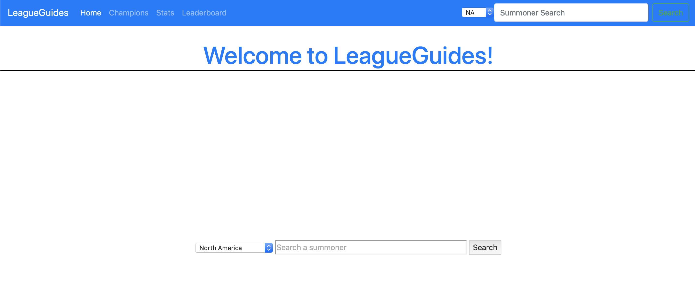
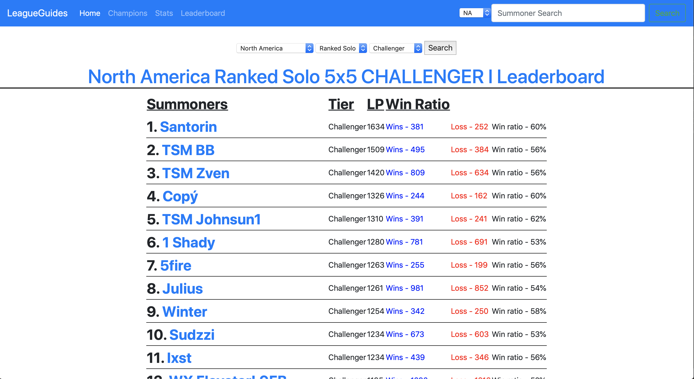
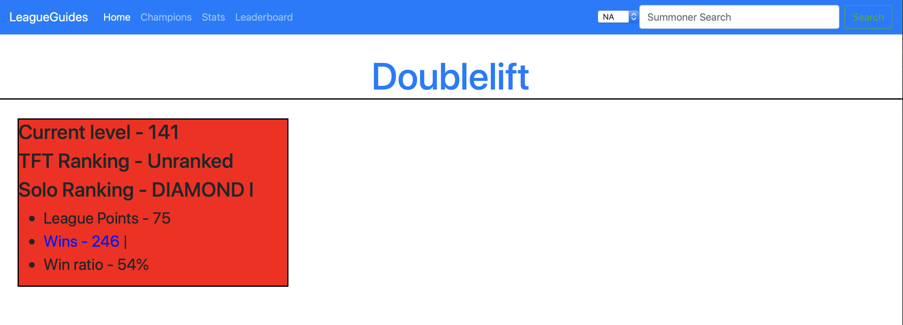

# LeagueGuide
A website I made over the summer about League of Legends using python, flask, html, css, boostrap, and javascript that utilizes the Riot API to grab data and display it.

Homepage

Ranking list of top players of a region

Summoner profile

